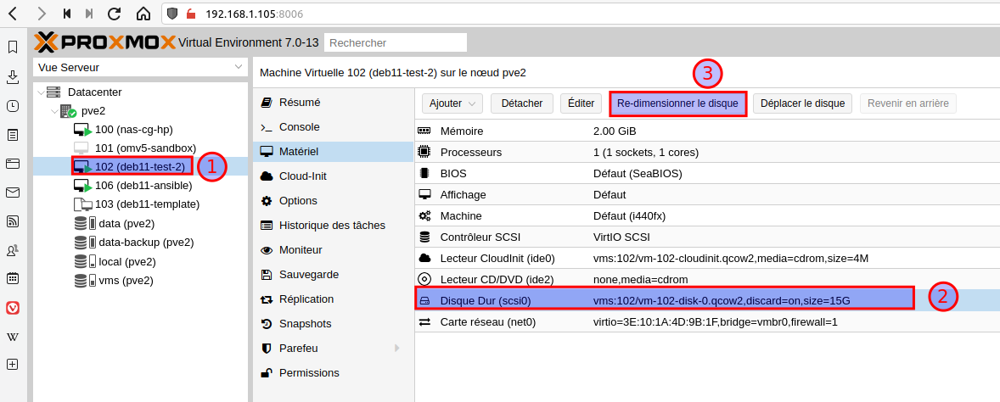
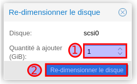

# Etendre l'espace disque d'une VM (partition lvm)


## Etape 1 : redimensionner le disque depuis l'interface Proxmox








## Etape 2 : agrandir la partition de la VM

### Affichage de la table de partition

```bash
sudo fdisk -l /dev/sda
```


### Redimensionnement de la partition étendue qui contient la partition LVM

```bash
# On instale parted
sudo apt install parted

# On execute parted
sudo parted /dev/sda

# On redimensionne la partition étendue (sda2 dans mon cas)
(parted)resizepart 2 100%

# On quitte parted
(parted)quit

# On réaffiche la table de partition (qui doit afficher la nouvelle taille)
sudo fdisk -l /dev/sda

# On re-éxecute parted
sudo parted /dev/sda

# On redimensionne la partition LVM (sda5 dans mon cas)
(parted)resizepart 5 100%

# On quitte parted
(parted)quit

# On réaffiche la table de partition (qui doit afficher la nouvelle taille)
sudo fdisk -l /dev/sda
```


### On étend la partition LVM

```bash
# On agrandit le volume physique
sudo pvresize /dev/sda5

# On agrandit le volume logique (faire df -h pour l'identifier)
sudo lvresize --extents +100%FREE --resizefs /dev/mapper/deb11--template--vg-root

# On vérifie l’espace disque
sudo lsblk
df -hT
```

